# 招聘系统完整业务流程图

## 1. 系统整体架构图

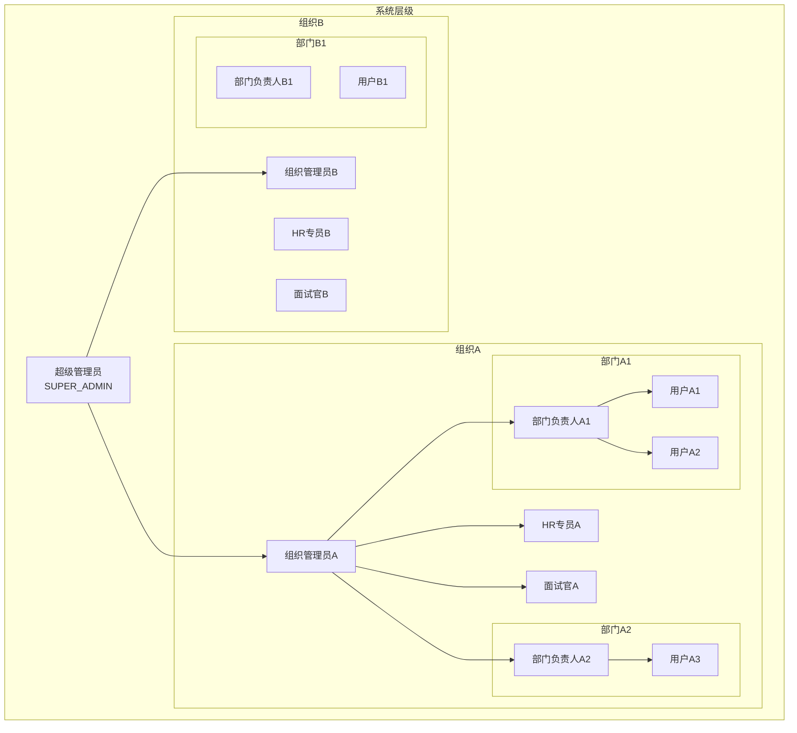

## 2. 系统初始化流程

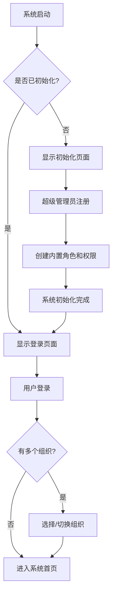

## 3. 组织和用户管理流程

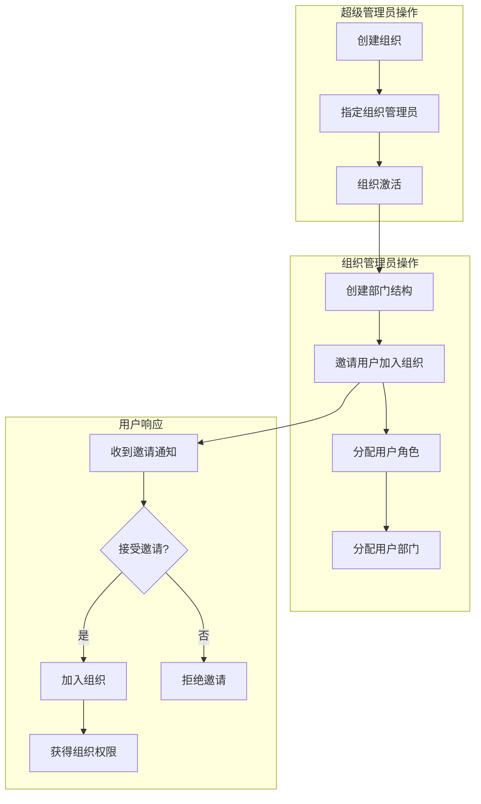

## 4. 完整招聘业务流程

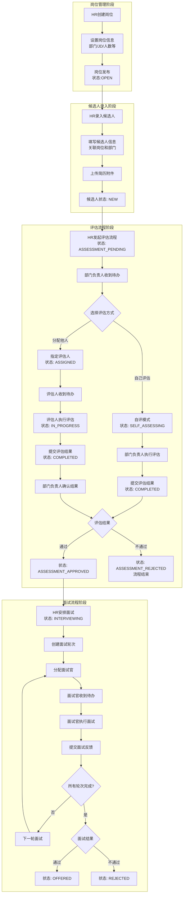

## 5. 评估流程详细图

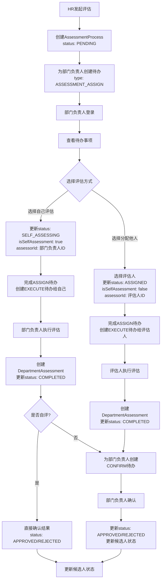

## 6. 面试流程详细图

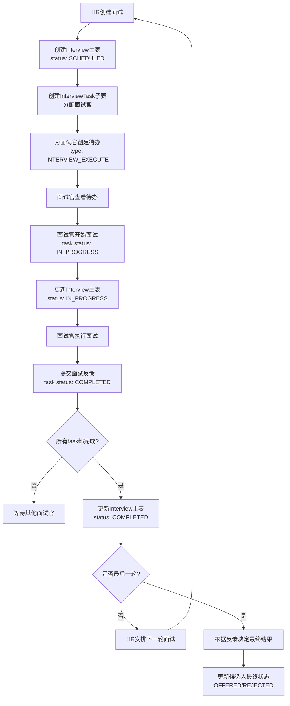

## 7. 待办事项流转图

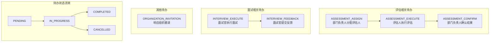

## 8. 候选人状态流转图

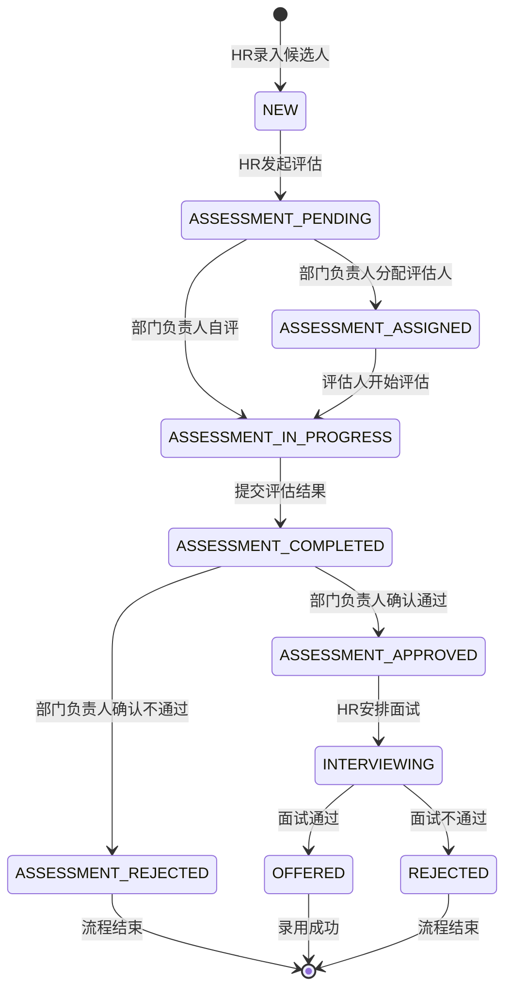

## 9. 权限控制流程图

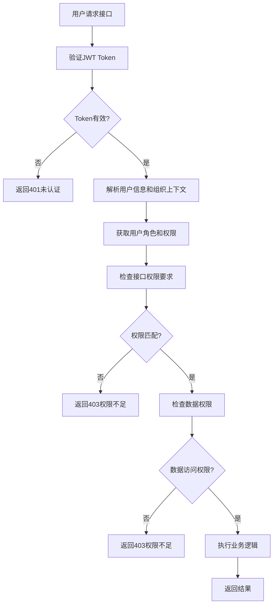

## 10. 数据权限控制图

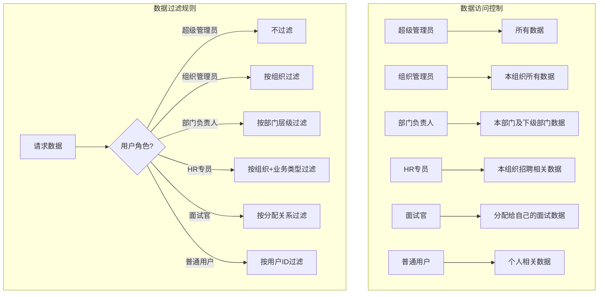

## 11. 系统集成流程图

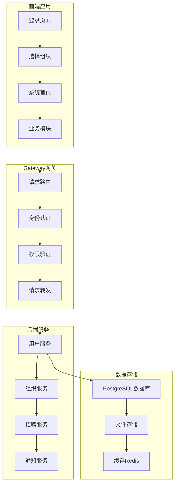

这个完整的业务流程图涵盖了：

1. **系统架构**：多组织、多层级的用户管理
2. **初始化流程**：系统冷启动和基础数据创建
3. **组织管理**：组织创建、用户邀请、角色分配
4. **招聘流程**：从岗位创建到候选人录用的完整流程
5. **评估流程**：部门评估的详细步骤和状态流转
6. **面试流程**：多轮面试的管理和执行
7. **待办事项**：基于业务流程的任务管理
8. **状态流转**：候选人状态的完整生命周期
9. **权限控制**：请求级别和数据级别的权限验证
10. **系统集成**：前后端交互和服务架构

每个流程图都详细展示了各个角色的职责、操作步骤和系统响应，可以作为开发和测试的重要参考。
